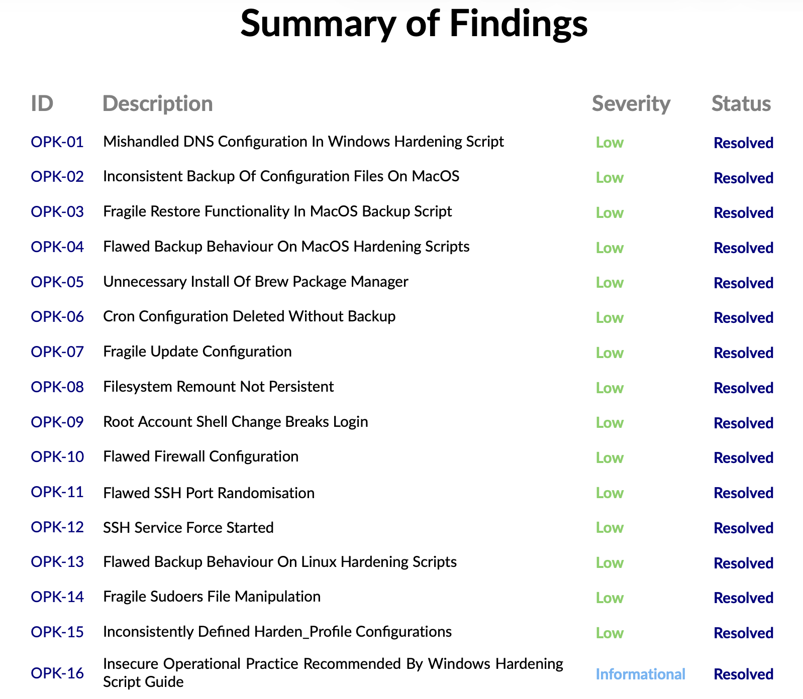

# Device hardening & factory reset guides

This repository provides **hardening scripts** and **factory reset guides** to help you secure your devices or react quickly if you suspect your device being compromised.    

⚠️ **Note:** These resources improve security but **cannot prevent you from running malicious code** on your device.  

Always be cautious with the software you install and the commands you execute.

---

## ✅ Audited by Sigma Prime

📄 Click the image to view the full audit report.
 
---

## Contents  

| OS       | Hardening script                   | Factory reset guide                          |
|----------|------------------------------------|----------------------------------------------|
| Linux    | [Hardening Script](./linux/)   | [Factory Reset Guide](./linux/factory-reset-linux.md)   |
| macOS    | [Hardening Script](./macos/)   | [Factory Reset Guide](./macos/factory-reset-macos.md)   |
| Windows  | [Hardening Script](./windows/) | [Factory Reset Guide](./windows/factory-reset-windows.md) |

---

## Contributing  

Pull requests and improvements are welcome!

