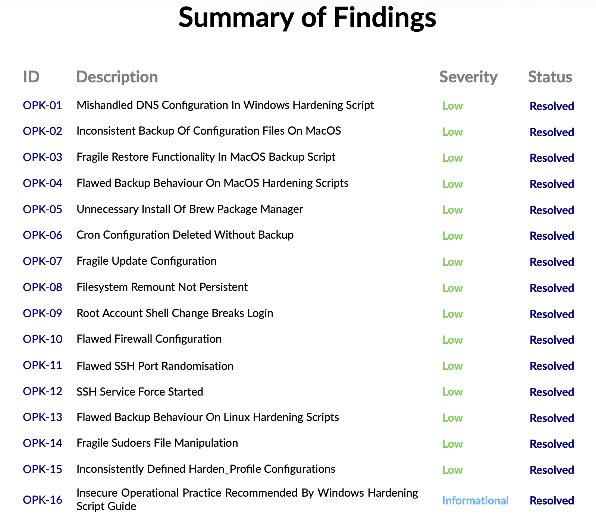

# Device hardening & factory reset guides

This repository provides **hardening scripts** and **factory reset guides** to help you secure your devices or react quickly if you suspect your device being compromised.

⚠️ **Note:** These resources improve security but **cannot prevent you from running malicious code** on your device.
Always be cautious with the software you install and the commands you execute.

---

## Contents

| OS       | Hardening script                | Factory reset guide                                       |
|----------|---------------------------------|-----------------------------------------------------------|
| Linux    | [Hardening Script](./linux/)    | [Factory Reset Guide](./linux/factory-reset-linux.md)     |
| macOS    | [Hardening Script](./macos/)    | [Factory Reset Guide](./macos/factory-reset-macos.md)     |
| Windows  | [Hardening Script](./windows/)  | [Factory Reset Guide](./windows/factory-reset-windows.md) |

---

## 🛡️ Security audits

This project has been independently audited by **two** security firms:

| Auditor | Report |
|---|---|
| [**Sigma Prime**](https://sigmaprime.io/) | 📄 [View report (PDF)](./audit-report-hardening-scripts.pdf) |
| [**Coinspect**](https://www.coinspect.com/) | 📄 [View report (PDF)](./Coinspect%20-%20Source%20Code%20Review%20-%20Opsek%20-%20OSs%20Hardening%20Scripts%20-%20v260303.pdf) |

### Sigma Prime report preview

*Click the image to view the full Sigma Prime audit report.*

---

## Contributing

Pull requests and improvements are welcome!
