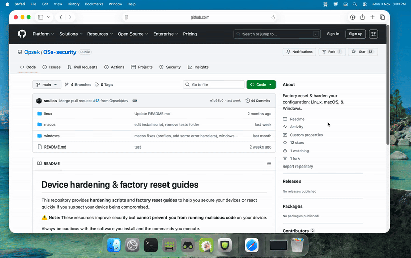

# 🛡️ macOS hardening script
 
This project provides a comprehensive security hardening solution for macOS systems, integrating both CIS (Center for Internet Security) benchmarks and OPSEK-specific security measures. It is designed to enhance the security posture of macOS machines through automated configuration and hardening processes. Must run as **Administrator** for full effect.

---

## ⚠️ Warnings

**Important considerations before use:**

1. **Backup**: Always backup your system before running the hardening script
2. **Testing**: Use the `--dry-run` option first to preview changes
3. **System Impact**: Some security measures may affect system functionality or user experience
4. **Root Access**: The script requires root privileges to apply system-level changes
5. **Recovery**: Some changes may be difficult to reverse - review the settings carefully
6. **Compatibility**: Certain applications may not work properly under strict security profiles

---

## Installation

1. Clone the repository:
```bash
git clone <repository-url>
cd macos-hardening
```

2. Make the main script executable:
```bash
chmod +x main.sh
```

3. Review the configuration in `config/settings.conf` and adjust if needed.

---

## 🚀 Usage



The script supports different security profiles to match your security requirements:

```bash
# Run with default recommended profile (suitable for most users)
sudo ./main.sh

# Run in test mode (dry-run)
sudo ./main.sh --dry-run

# Run with compliance checks
sudo ./main.sh --checks

# Run the paranoid profile (maximum restrictions)
sudo ./main.sh --paranoid
```

Available profiles:
- **recommended**: Balanced security suitable for most environments
- **paranoid**: Maximum security (may affect system functionality)

---

## 🔧 Available hardening functions

### 🖥️ System security

| Command                    | What we are doing                               | What it protects from                               |
| -------------------------- | ----------------------------------------------- | --------------------------------------------------- |
| `update_system`            | Ensures macOS and packages are up to date       | Protects from known vulnerabilities                 |
| `enable_gatekeeper`        | Enforces app signing and notarization           | Blocks unsigned or malicious apps                   |
| `configure_hibernate_mode` | Secures system sleep and hibernation            | Prevents data leakage from RAM or sleep image       |
| `harden_kernel`            | Applies kernel-level security parameters        | Hardens system against kernel exploits              |
| `fix_system_permissions`   | Corrects system file permissions                | Prevents privilege escalation via modified binaries |
| `fix_library_permissions`  | Secures `/Library` and user library permissions | Stops privilege abuse and code injection            |

### 🌐 Network security

| Command                       | What we are doing                              | What it protects from                         |
| ----------------------------- | ---------------------------------------------- | --------------------------------------------- |
| `enable_firewall`             | Activates and configures the built-in firewall | Blocks unauthorized network access            |
| `disable_internet_sharing`    | Disables Internet sharing features             | Prevents rogue access point creation          |
| `disable_remote_apple_events` | Blocks AppleScript remote control              | Prevents remote code execution                |
| `disable_bonjour`             | Disables multicast DNS (Bonjour)               | Reduces attack surface and discovery exposure |
| `disable_wake_on_lan`         | Disables Wake-on-LAN                           | Prevents remote wake and potential tampering  |
| `disable_ipv6_on_interfaces`  | Turns off IPv6 on unused interfaces            | Mitigates IPv6-based attacks                  |

### 🔐 Access control

| Command                      | What we are doing                             | What it protects from                     |
| ---------------------------- | --------------------------------------------- | ----------------------------------------- |
| `disable_automatic_login`    | Requires authentication at startup            | Prevents unauthorized boot access         |
| `require_password_wake`      | Enforces password on wake                     | Protects sessions from physical access    |
| `configure_password_policy`  | Sets strong password requirements             | Stops weak password-based compromise      |
| `disable_guest_account`      | Disables guest login                          | Prevents anonymous local logins           |
| `disable_root_account`       | Locks the root user                           | Prevents root login abuse                 |
| `configure_sudo_timeout`     | Sets sudo command timeout                     | Reduces window for privilege escalation   |
| `require_admin_system_prefs` | Requires admin credentials for system changes | Prevents unauthorized system modification |

### 🧭 Privacy & Data protection

⚠️ Note: `enable_filevault` cannot be activated automatically from a script, it must be enabled manually via `System Settings` → `Privacy & Security` → `FileVault`.

| Command                         | What we are doing                                    | What it protects from                |
| ------------------------------- | ---------------------------------------------------- | ------------------------------------ |
| `secure_home_folders`           | Restricts access to user home directories            | Prevents cross-user data exposure    |
| `configure_privacy_settings`    | Applies privacy preferences (camera, mic, analytics) | Reduces telemetry and data leaks     |
| `disable_location_services`     | Disables or restricts location tracking              | Prevents geolocation tracking        |
| `disable_spotlight_suggestions` | Disables online search suggestions                   | Stops data sent to Apple servers     |
| `disable_diagnostics`           | Disables system diagnostics uploads                  | Prevents telemetry data exfiltration |

---

## Structure

The project follows a modular structure for better organization and maintainability:

- `main.sh`: Primary script that orchestrates the hardening process
- `config/`: Configuration files for profiles and settings
- `modules/`: Core functionality modules
  - `cis/`: CIS benchmark implementation modules
  - `internals/`: OPSEK-specific security modules
- `utils/`: Utility scripts for common functions
- `checks/`: Compliance and verification scripts
```
macos-hardening/
├── README.md
├── main.sh                    # Main script
├── config/
│   ├── profiles.conf          # Profile configuration
│   └── settings.conf          # General settings
├── modules/
│   ├── cis/                   # CIS Benchmark modules
│   │   ├── system.sh          # System configuration
│   │   ├── network.sh         # Network configuration
│   │   ├── services.sh        # System services
│   │   ├── permissions.sh     # Permissions and security
│   │   └── users.sh           # User configuration
│   └── internals/             # OPSEK modules
│       ├── bluetooth.sh       # Bluetooth management
│       ├── wifi.sh           # Wi-Fi management
│       ├── lockdown.sh       # Lockdown mode
│       ├── privacy.sh       # Privacy settings
│       └── kernel.sh        # Kernel hardening
├── utils/
│   ├── common.sh             # Common utility functions
│   ├── logging.sh            # Logging system
│   └── backup.sh             # Backup management
├── checks/
│   ├── cis_checks.sh         # CIS compliance checks
│   └── opsek_checks.sh       # OPSEK compliance checks
```

---

For any issues or questions, please open an issue on the project repository.
