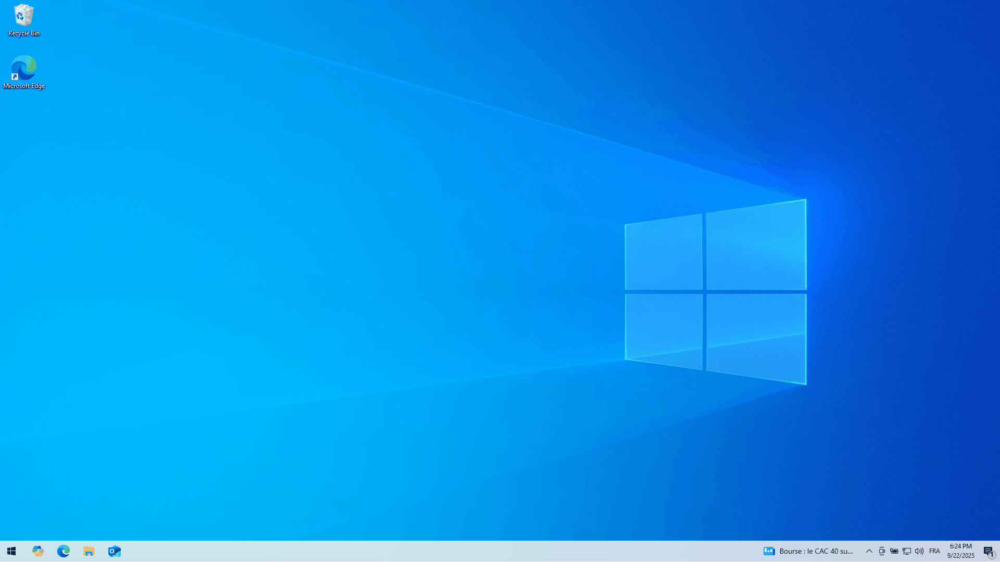

# 🛡️ Windows Hardening — README

This repository contains `hardening-windows.ps1`, a PowerShell script that audits and applies a set of Windows security hardening steps.

Key points:
- Two primary modes: **Audit** (non-destructive) and **Harden** (applies fixes).
- Modules are defined as Check/Apply pairs and registered in a `$Modules` registry.
- The script writes a timestamped log to `%TEMP%\Windows_Hardening_YYYYMMDD_HHMMSS.log`.

---

## 🚀 Usage

### ⚠️ Security Warning - Read First!
**Never execute scripts directly from the internet without review!** Always:
1. Download the script first
2. Review the code to understand what it does
3. Only execute after you've verified it's safe

Run PowerShell as Administrator :

```powershell
Invoke-WebRequest -Uri "https://raw.githubusercontent.com/Opsek/OSs-security/main/windows/hardening-windows.ps1" -OutFile ".\hardening-windows.ps1"
powershell -NoProfile -ExecutionPolicy Bypass -File .\hardening-windows.ps1 -Audit
```
---

## Modes and examples

- `-Audit` — Collects checks and reports statuses. No changes are made.
- `-Harden` — Applies remediation for modules reporting `FAIL`. Modules that require confirmation still prompt the user.
- `-Module <regex>` — Filters modules by regular expression on the module `Name` (case-insensitive). Useful for narrowing scope.


```powershell
powershell -NoProfile -ExecutionPolicy Bypass

# Audit (no changes)
.\hardening-windows.ps1 -Audit

# Apply hardening changes
.\hardening-windows.ps1 -Harden

# Audit a specific module (regex filter)
.\hardening-windows.ps1 -Audit -Module "UAC"

```




## 🔧 Automated hardening commands


| Command | What we are doing | What it protects from | Edition Support |
|---------|------------------|------------------------|------------------|
| `Set-ItemProperty ... ConsentPromptBehaviorAdmin 2` | Force UAC to **Always Notify** | Prevents silent privilege escalation | All |
| `Set-NetFirewallProfile ...` | Enable Firewall (Domain, Public, Private) | Blocks unauthorized inbound/outbound traffic | All |
| `Set-ProcessMitigation ...` | Enable **DEP, ASLR, SEHOP** | Stops memory-based exploits | **Pro+** (skipped on Home) |
| `Set-MpPreference -PUAProtection Enabled` | Enable PUA protection | Blocks unwanted / malicious software | All |
| `Get-MpComputerStatus` | Verify Defender status | Detects if antivirus is disabled by GPO | All |
| `Set-Service wuauserv ...` | Ensure Windows Update is enabled | Protects against known vulnerabilities | All |
| `New-ItemProperty ... HypervisorEnforcedCodeIntegrity` | Enable **Memory Integrity** | Prevents kernel-level tampering | **Pro+** |
| `Get-BitLockerVolume / Enable-BitLocker` | Enable BitLocker with TPM protector | Protects data at rest from theft | **Pro+** (Home: Device Encryption) |
| `Get-Tpm` | Verify TPM presence before BitLocker | Ensures cryptographic strength | **Pro+** |
| `reg add ... DeviceGuard / LsaCfgFlags` | Enable **Credential Guard** (with CPU check) | Protects credentials from theft (Mimikatz, etc.) | **Pro+** (Home: skipped) |
| `reg add ... VBAWarnings=4` | Disable Office Word macros | Blocks macro-based malware | All |
| `powercfg /change monitor-timeout-ac 1` | Set screen timeout to 1 min | Reduces risk from unattended sessions | All |
| `reg add ... RunAsPPL=1` | Enable **LSA Protection** | Protects LSASS from credential dumping | All |
| `Set-ItemProperty ... fDenyTSConnections=1` | Disable Remote Desktop | Prevents RDP brute force attacks | All |
| `Disable-WindowsOptionalFeature -FeatureName SMB1Protocol` | Disable SMBv1 | Blocks exploitation via WannaCry/EternalBlue | All |
| `Confirm-SecureBootUEFI` | Check Secure Boot (UEFI only) | Protects boot chain from tampering | **UEFI systems** |
| `Set-ItemProperty ... HideFileExt=0` | Enable file extension visibility | Improves detection of suspicious files | All |
| `Set-ItemProperty ... TurnOffWindowsCopilot` | Disable Windows Copilot / AI | Reduces telemetry & data collection | All |
| `reg add ... DisableFileSyncNGSC=1` | Disable OneDrive cloud sync | Prevents forced cloud integration | All |
| Uninstall OneDrive client | remove OneDrive | Reduces bloatware & background processes | All |


---

## 🧩 Optional (User-confirmed) Modules

| Command | What we are doing | What it protects from | Notes |
|---------|------------------|------------------------|-------|
| `reg add ... DenyRemovableDevices=1` | Block USB removable device installation | Prevents USB malware / BadUSB | May break legitimate USB usage |
| `Set-DnsClientServerAddress ... 9.9.9.9` | Set secure DNS (Quad9) | Protects from DNS hijacking/malicious resolvers | With validation test |
| `Set-MpPreference -EnableControlledFolderAccess Enabled` | Enable Controlled Folder Access | Blocks ransomware from encrypting user data | May block legitimate apps |


## ⚡ Reboot Requirements

The following changes require a **system reboot** to take effect:

- ✅ Memory Integrity (Device Guard)
- ✅ Credential Guard
- ✅ LSA Protection (RunAsPPL)
- ✅ BitLocker encryption (initial setup)
- ✅ SMBv1 disable
- ✅ Most registry-based Group Policies

**The script will prompt you to reboot at the end.** Plan accordingly!

---

## 🔍 Troubleshooting

### Script fails with "Administrator privileges required"
- Run PowerShell as Administrator (right-click → "Run as administrator")

### BitLocker recovery key not displayed
- Check the audit log: `%TEMP%\Windows_Hardening_*.log`
- Recovery key is saved to the log file with [CRITICAL] severity

### Process mitigation fails on Home Edition
- This is expected. Home Edition doesn't support advanced process mitigation.
- The script automatically skips this with a message.

### DNS validation fails
- Check your internet connection
- Verify 9.9.9.9 (Quad9) is reachable in your network
- Check firewall rules for DNS (port 53)

### Credential Guard doesn't enable
- Check if CPU virtualization is enabled in BIOS
- Verify Windows edition is Pro or Enterprise
- Run: `systeminfo | findstr /C:"Hyper-V"`

## 📚 References

- [Windows Security Baselines (CIS)](https://www.cisecurity.org/benchmark/windows)
- [Microsoft Security Best Practices](https://docs.microsoft.com/en-us/security/)
- [BitLocker Deployment Guide](https://docs.microsoft.com/en-us/windows/security/information-protection/bitlocker/bitlocker-deployment-guide-planning)
- [Credential Guard](https://docs.microsoft.com/en-us/windows/security/identity-protection/credential-guard/credential-guard)
- [Windows Defender Guide](https://docs.microsoft.com/en-us/windows/security/threat-protection/microsoft-defender-antivirus/microsoft-defender-antivirus-in-windows-10)
- [Quad9 DNS](https://www.quad9.net/)
- [LSA Protection](https://docs.microsoft.com/en-us/windows-server/security/credentials-protection-and-management/configuring-additional-lsa-protection)
